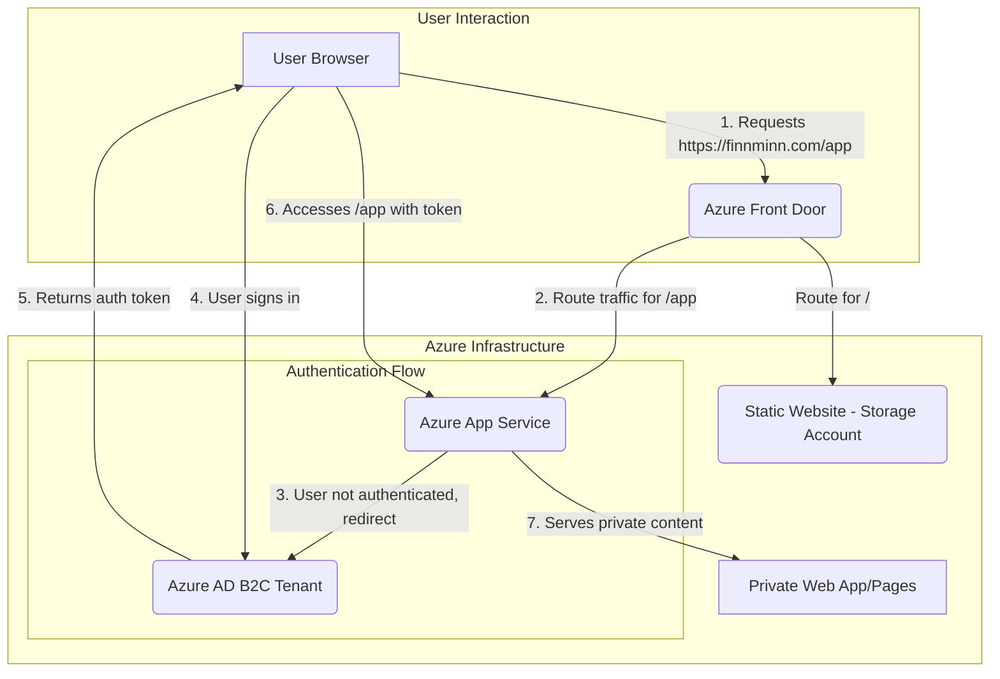

```mermaid
graph TD
    subgraph "User Interaction"
        U[User Browser] -->|1. Requests https://finnminn.com/app| AFD
    end

    subgraph "Azure Infrastructure"
        AFD(Azure Front Door) -->|2. Route traffic for /app| AppSvc(Azure App Service)
        AFD -->|Route for /| SAS(Static Website - Storage Account)

        subgraph "Authentication Flow"
            AppSvc -->|3. User not authenticated, redirect| B2C(Azure AD B2C Tenant)
            U -->|4. User signs in| B2C
            B2C -->|5. Returns auth token| U
            U -->|6. Accesses /app with token| AppSvc
        end

        AppSvc -->|7. Serves private content| AppContent[Private Web App/Pages]
    end
```
