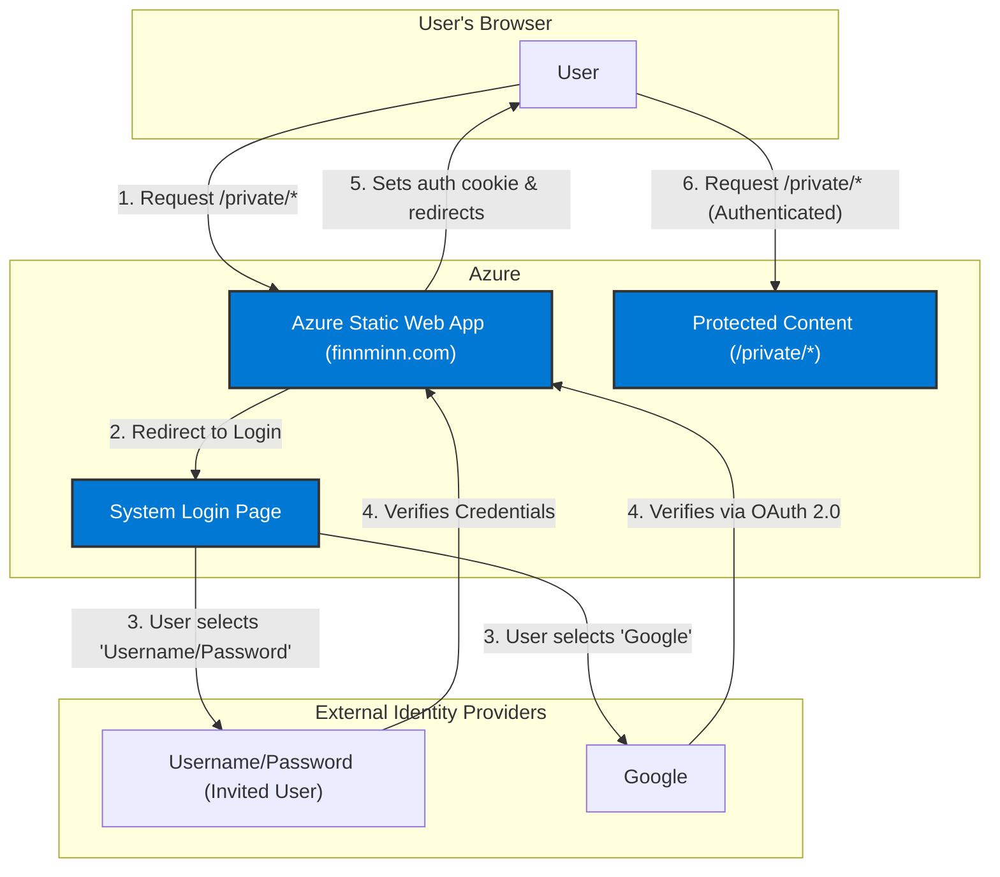

# Architecture Overview: User Authentication

## 1. Problem Statement

The goal is to add a user authentication system to the `finnminn.com` website. The system must restrict access to certain static HTML pages, making them available only to a small, private group of pre-authorized users. The solution needs to support both username/password and Google social logins, while remaining simple, serverless, and cost-effective, in line with the project's hobby-level nature.

## 2. Proposed Architecture

We will migrate the website to **Azure Static Web Apps**, a fully managed Azure service that is purpose-built for hosting modern web applications with integrated serverless backends and authentication.

This approach was chosen because it dramatically simplifies the implementation by providing a single, cohesive service that handles static content hosting, global distribution, and, most importantly, a built-in authentication and authorization system. It is the simplest and most direct way to meet all stated requirements on the Azure platform.

### Architecture Diagram

## 3. Data and Authentication Flow

1.  **Initial Request:** An unauthenticated user navigates to a protected page (e.g., `https://finnminn.com/private/dashboard.html`).
2.  **Redirection to Login:** The Azure Static Web App service intercepts the request. Based on routing rules defined in `staticwebapp.config.json`, it determines the user must be authenticated. The user is automatically redirected to a system-provided login page.
3.  **Provider Selection:** The user chooses to log in with either their pre-registered username/password or their Google account.
4.  **Authentication:**
    *   **Google:** The user is redirected to Google's OAuth 2.0 sign-in flow. After successful authentication, Google redirects the user back to the Static Web App with an authentication token.
    *   **Username/Password:** The user enters their credentials. The Static Web App service validates them against its invited users list.
5.  **Session Creation:** Upon successful validation, the Static Web App service creates a secure session for the user, managed via an encrypted cookie. The user's name and email are available to the application.
6.  **Access Granted:** The user is redirected back to the originally requested protected page (`/private/dashboard.html`) and can now view the content. Subsequent requests to any other protected pages will succeed as long as the session is valid.

## 4. Key Design Decisions

*   **Service Choice:** We chose **Azure Static Web Apps** over extending the existing Storage Account + Front Door setup. While the existing setup works for public static content, adding robust authentication would require significantly more complex and custom components (e.g., Azure Functions for auth callbacks, a database for users, custom code to secure content). Static Web Apps provides all this functionality out-of-the-box in a more secure, integrated, and cost-effective manner.
*   **Serverless-First:** This architecture is fully serverless. There are no virtual machines or application servers to manage, patch, or scale.
*   **Configuration over Code:** Access control is primarily handled through a declarative JSON configuration file (`staticwebapp.config.json`), minimizing the need for custom application code to secure routes.

## 5. Impact on Existing Public Website

This architecture involves migrating the **entire** website, including the existing public pages (`index.html`, etc.), from the current Azure Storage Account to the new Azure Static Web App.

**This does not mean the public content is being removed or changed.** From an end-user's perspective, the public website will look and function exactly as it does today. The URLs will remain the same.

We are recommending this unified hosting approach for several key reasons:

*   **Simplified Management:** It is significantly simpler to manage one hosting platform (Azure Static Web Apps) rather than splitting the site across two different services (Azure Storage for public content and Azure Static Web Apps for private content).
*   **Unified Routing:** All routing and access control rules for both public and protected pages can be managed in a single `staticwebapp.config.json` file, providing a single source of truth for the site's behavior.
*   **Seamless User Experience:** Hosting the entire site on one platform ensures a smooth, fast experience for users as they navigate between public and private sections of the website without any jarring redirects between different underlying services.
