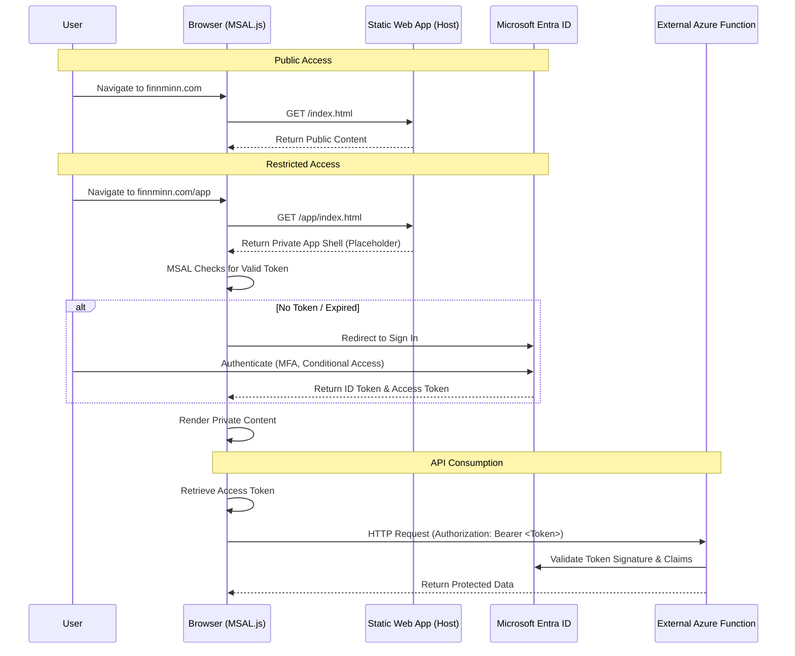

# Architecture Overview: Client-Side Authentication with Microsoft Entra ID

## 1. Introduction
This document outlines the architecture for adding a secure, private section (`/app`) to the `finnminn.com` static website. 

The primary challenge is to provide authentication that is cost-effective (utilizing the Azure Static Web Apps Free Tier) while maintaining the flexibility to secure external resources. Unlike the built-in "Easy Auth" of Static Web Apps, which is bound to a single domain and managed backend, this solution utilizes **Client-Side Authentication** with **Microsoft Entra ID (formerly Azure AD)**.

This approach decouples identity from the hosting platform, allowing:
- **Cross-Resource Access:** The same authentication session can be used to call standalone Azure Functions in different repositories.
- **Cross-Subdomain Support:** Authentication can persist across `app.finnminn.com`, `admin.finnminn.com`, etc.
- **Strict User Provisioning:** Leveraging Enterprise Application controls in Azure to restrict access to specific users, despite using a public hosting tier.

## 2. Architecture Diagram

## 3. Data Flow & Key Decisions

### 3.1 Client-Side vs. Server-Side Auth
We selected **Client-Side (SPA) Authentication** using the **Microsoft Authentication Library (MSAL.js)**.
- **Why:** Azure Static Web Apps Free Tier does not support server-side middleware for custom auth logic or sharing sessions with external APIs.
- **How:** The browser handles the entire login flow. The Static Web App serves only HTML/JS assets and is unaware of the user's identity.

### 3.2 Identity Provider: Microsoft Entra ID
We utilize the tenant's native Entra ID rather than a social provider (GitHub/Google).
- **Why:** It provides "Enterprise" features for free. We can leverage the **"Assignment Required"** property in the Service Principal to strictly allow-list users without writing code or paying for hosting upgrades.

### 3.3 Token Usage
The result of the login is an **Access Token** (JWT). This token is the key to the ecosystem.
- **Frontend:** Used to determine UI state (Show/Hide).
- **Backend:** Used as a bearer credential for APIs. Any Azure Function configured to trust this specific Entra ID App Registration will accept requests from this frontend.
