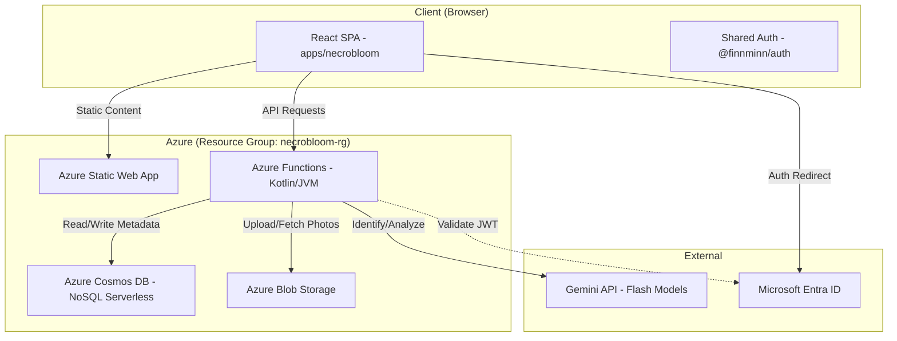

# NecroBloom Architecture Overview

## Problem Statement
"Bringing life back from the void."
Users need a way to track the health of their houseplants within the "PixelGrim" ecosystem. NecroBloom provides a gothic, whimsical interface for plant identification, care plan generation, and health monitoring using AI, ensuring a "ghoulishly green" thumb for every agent.

## Architecture
The system follows a serverless, event-driven pattern integrated into the existing finnminn.com monorepo.

## Data Flow
1. **Identification**: User uploads a photo of a new plant. The Kotlin Function saves it to Blob Storage and sends the image to Gemini Flash for identification. Gemini returns a plant profile (species, initial care plan).
2. **Persistence**: The profile is saved to Cosmos DB, partitioned by `userId`.
3. **Health Check**: Users upload a health photo. Gemini Flash compares the current state against historical reports in Cosmos DB to provide a "Vitality Report" and care adjustments.
4. **Care Instructions**: Based on the plant's profile and user-provided environment context (zip code, indoor lighting), Gemini generates instructions.

## Key Design Decisions
- **Gemini Flash Only**: Optimized for speed and cost-effectiveness for a hobby project.
- **Serverless Everything**: No fixed costs; the app scales to zero when not in use.
- **Manual Setup**: Infrastructure will be created via the Azure Portal to keep the setup simple and direct.
